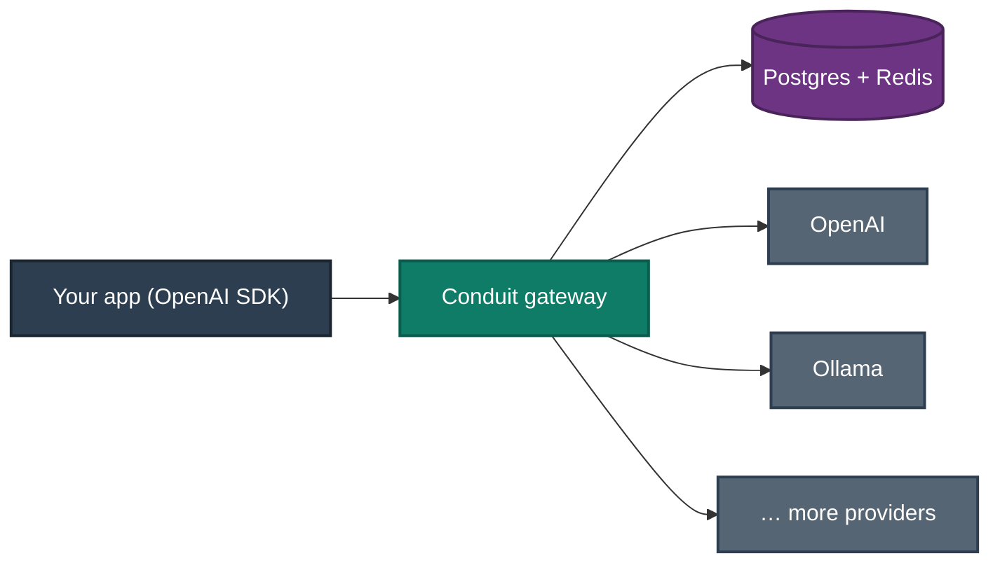

<div align="center">

# Conduit

**The open-source AI Gateway.** One OpenAI-compatible API in front of every model provider — with routing, reliability, cost control, governance, and observability built in.

*NGINX / Kong / Envoy — but for LLM traffic.*

`OpenAI-compatible` · `async` · `multi-provider` · `self-hostable`

</div>

> **Status:** early development. See [`docs/ROADMAP.md`](docs/ROADMAP.md) for the plan and what's built.
> **Name:** `Conduit` is a working codename — verify availability before any public release.

---

## Why

Applications should solve business problems, not babysit AI infrastructure. Today every app wires up provider SDKs, retries, fallbacks, rate limits, budgets, logging, and tracing by hand — and re-does it for the next provider.

Conduit is the control plane that owns all of it. Point your existing OpenAI client at Conduit and it decides, per request: which provider, which model, whether to retry, fall back, cache, or reject; whether the budget and rate limits allow it; and how the request is logged and traced. Your code changes the `base_url` and nothing else.

## What it does

- **Drop-in OpenAI compatibility** — a stock OpenAI SDK works unmodified; just change `base_url`.
- **Multi-provider** — OpenAI and Ollama today; a clean adapter contract for Anthropic, Gemini, Bedrock, vLLM, and anything next.
- **Reliable by default** — retries with backoff, per-provider circuit breakers, health checks, automatic fallback.
- **Cost & governance** — API keys, token-bucket rate limits, per-key/org budgets, usage and cost accounting.
- **Intelligent routing** — cost-, latency-, and capability-aware model selection behind declarative policies.
- **Observable** — OpenTelemetry traces, Prometheus metrics, Grafana dashboards for cost, latency, tokens, and errors.
- **Optimized** — exact + semantic response caching, in-flight dedup, opt-in replay, pre-flight cost estimation (`POST /v1/estimate`), error-rate adaptive routing, and a `conduit bench` harness.

## Architecture at a glance



Conduit uses a hexagonal design: a thin FastAPI edge, an orchestration pipeline, a pure domain core (schemas, routing, reliability), and adapters for providers and infrastructure. Full design in [`docs/ARCHITECTURE.md`](docs/ARCHITECTURE.md).

## Quickstart

**Prerequisites:** Docker (with Compose) — and at least one upstream to route to:
an OpenAI API key, or a local [Ollama](https://ollama.com) with a model pulled.

```bash
git clone <repo> && cd conduit
cp .env.example .env
```

Edit `.env` and point Conduit at an upstream:

- **OpenAI:** set `CONDUIT_OPENAI_API_KEY=sk-...` (models `gpt-4o`, `gpt-4o-mini`).
- **Ollama:** run `ollama serve` and `ollama pull llama3.2`, then set
  `CONDUIT_OLLAMA_BASE_URL=http://host.docker.internal:11434` (models `llama3.2`,
  `llama3.1`, `qwen2.5`).

Bring up the stack (API + Postgres + Redis) and mint a key:

```bash
make up                                        # builds + starts; API on :8080
curl -s localhost:8080/healthz                 # -> {"status":"ok"}
curl -s localhost:8080/readyz                  # -> dependencies all "ok"
docker compose exec api conduit keys create    # prints a ck-... key ONCE — save it
```

Point a stock OpenAI client at Conduit — only the `base_url` changes:

```python
from openai import OpenAI

client = OpenAI(base_url="http://localhost:8080/v1", api_key="ck-your-conduit-key")

resp = client.chat.completions.create(
    model="gpt-4o-mini",              # or "llama3.2" — Conduit routes by model
    messages=[{"role": "user", "content": "Hello from Conduit"}],
)
print(resp.choices[0].message.content)

# Streaming works the same way:
for chunk in client.chat.completions.create(
    model="gpt-4o-mini",
    messages=[{"role": "user", "content": "Stream it"}],
    stream=True,
):
    print(chunk.choices[0].delta.content or "", end="")
```

Or with `curl`:

```bash
curl -s http://localhost:8080/v1/chat/completions \
  -H "Authorization: Bearer ck-your-conduit-key" \
  -H "Content-Type: application/json" \
  -d '{"model": "gpt-4o-mini", "messages": [{"role": "user", "content": "Hello"}]}'
```

`make down` stops the stack. Working locally without Docker? `make install` then
`make dev` runs the API against your own Postgres/Redis, and `make key` mints a
key from the host.

## Observability

Conduit ships with the full observability stack behind a compose profile:

```bash
make up-observability   # api + postgres + redis + otel-collector + prometheus + grafana
```

- **Metrics** — the API exposes Prometheus metrics at `http://localhost:8080/metrics`
  (gated by `CONDUIT_METRICS_ENABLED`, on by default). Prometheus scrapes it at
  `http://localhost:9090`.
- **Traces** — spans are exported over OTLP/HTTP to the OpenTelemetry Collector
  (set `CONDUIT_OTEL_EXPORTER_OTLP_ENDPOINT`; unset = no-op). The bundled collector
  logs received spans; point its exporter at Tempo/Jaeger for a real backend.
- **Dashboards** — Grafana at `http://localhost:3000` (admin / admin) auto-provisions
  the Prometheus datasource and three dashboards: **Gateway Overview**,
  **Per-Provider**, and **Governance**.

By design, secrets, API keys, and prompt/response bodies never appear in logs,
spans, or metric labels, and metric label cardinality stays bounded — see
[ADR-0007](docs/adr/0007-observability.md).

## Optimization

Conduit cuts cost and latency without any client change (all opt-in or transparent):

- **Caching** — identical deterministic requests (`temperature == 0`, no tools/vision)
  are served from Redis with no upstream call, for both unary and streaming;
  `Cache-Control: no-store` bypasses. A **semantic** near-match cache (embedding +
  vector index, off by default) serves paraphrases above a similarity threshold.
- **In-flight dedup** — concurrent identical requests collapse into one upstream call.
- **Cost prediction** — `POST /v1/estimate` returns the pre-flight cost of the chosen
  route and alternatives (a Conduit extension; the chat contract is unchanged).
- **Replay** — opt-in capture (`CONDUIT_REPLAY_CAPTURE_ENABLED`) + `POST /v1/admin/replays/{id}`
  to re-run a captured request through the current pipeline, optionally under a
  different routing policy.
- **Adaptive routing** — the balanced strategy de-weights a provider whose error rate
  is climbing and lets it recover, from worker-maintained rolling aggregates.
- **Benchmarking** — `conduit bench` reports latency percentiles, throughput, cost,
  and error rate across providers/models (mocked by default, `--live` for real):

```
PROVIDER   MODEL                    REQ   ERR%    p50ms    p95ms    p99ms     RPS      COST$
ollama     llama3.2                  10   0.0%      2.5      2.6      2.6  1209.0   0.000000
openai     gpt-4o-mini               10   0.0%      2.6      2.6      2.6  1271.0   0.000075
```

See [ADR-0008](docs/adr/0008-optimization.md) for the caching, dedup, semantic,
replay-privacy, and adaptive-routing design.

## Feature roadmap

| Phase | Theme | Highlights |
|---|---|---|
| **1 — MVP** | A real product | OpenAI-compatible API, OpenAI + Ollama, auth, streaming, Docker |
| **2 — Reliability** | Production infra | Redis, rate limits, budgets, usage, retries, circuit breakers, fallback, workers |
| **3 — Routing** | Smart selection | Cost / latency / capability-aware routing, declarative policies, classification |
| **4 — Observability** | See everything | OpenTelemetry, Prometheus, Grafana, traces, cost & latency dashboards |
| **5 — Optimization** | Do more with less | Semantic caching, dedup, replay, cost prediction, adaptive routing, benchmarking |

Details and per-phase acceptance criteria: [`docs/ROADMAP.md`](docs/ROADMAP.md).

## Project layout

```
conduit/
├── CLAUDE.md                 # operating manual (start here if you're building)
├── README.md
├── pyproject.toml            # uv-managed; Python 3.12+
├── Makefile                  # task runner (make check, make up, …)
├── Dockerfile                # multi-stage image
├── docker-compose.yml        # api + postgres + redis (+ observability profile)
├── .env.example
├── docs/
│   ├── ROADMAP.md            # mission, non-goals, phased plan
│   ├── ARCHITECTURE.md       # system design + C4/Mermaid diagrams
│   ├── CONVENTIONS.md        # coding standards, testing, git
│   ├── adr/                  # architecture decision records
│   └── phases/               # concrete task checklists per phase
└── src/conduit/              # the service (created during the build)
```

## Development

```bash
make install     # uv sync + pre-commit hooks
make dev         # run the API with autoreload
make check       # lint + types + tests (run before every commit)
```

Standards, testing strategy, and workflow: [`docs/CONVENTIONS.md`](docs/CONVENTIONS.md).

## Contributing

Conduit aims to be adopted by engineering teams, so quality is the bar: production-worthy features, clean abstractions with recorded reasons, and tests for everything. Read [`CLAUDE.md`](CLAUDE.md), [`docs/ROADMAP.md`](docs/ROADMAP.md), and the relevant ADRs before opening a PR. Adding a provider should be a small, well-tested change against the adapter contract.

## License

TBD (an OSI-approved license — e.g. Apache-2.0 — recommended before public release).
