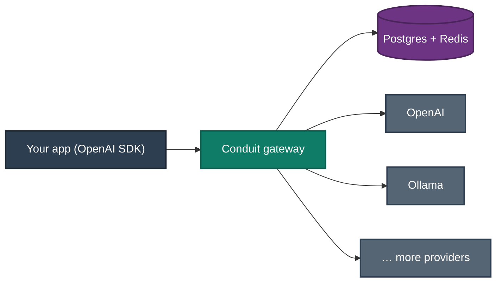

<div align="center">

# Conduit

**The open-source AI Gateway.** One OpenAI-compatible API in front of every model provider — with routing, reliability, cost control, governance, and observability built in.

*NGINX / Kong / Envoy — but for LLM traffic.*

`OpenAI-compatible` · `async` · `multi-provider` · `self-hostable`

</div>

> **Status:** early development. See [`docs/ROADMAP.md`](docs/ROADMAP.md) for the plan and what's built.
> **Name:** `Conduit` is a working codename — verify availability before any public release.

---

## Why

Applications should solve business problems, not babysit AI infrastructure. Today every app wires up provider SDKs, retries, fallbacks, rate limits, budgets, logging, and tracing by hand — and re-does it for the next provider.

Conduit is the control plane that owns all of it. Point your existing OpenAI client at Conduit and it decides, per request: which provider, which model, whether to retry, fall back, cache, or reject; whether the budget and rate limits allow it; and how the request is logged and traced. Your code changes the `base_url` and nothing else.

## What it does

- **Drop-in OpenAI compatibility** — a stock OpenAI SDK works unmodified; just change `base_url`.
- **Multi-provider** — OpenAI and Ollama today; a clean adapter contract for Anthropic, Gemini, Bedrock, vLLM, and anything next.
- **Reliable by default** — retries with backoff, per-provider circuit breakers, health checks, automatic fallback.
- **Cost & governance** — API keys, token-bucket rate limits, per-key/org budgets, usage and cost accounting.
- **Intelligent routing** — cost-, latency-, and capability-aware model selection behind declarative policies.
- **Observable** — OpenTelemetry traces, Prometheus metrics, Grafana dashboards for cost, latency, tokens, and errors.
- **Optimized** — semantic caching, request dedup and replay, token/cost estimation.

## Architecture at a glance



Conduit uses a hexagonal design: a thin FastAPI edge, an orchestration pipeline, a pure domain core (schemas, routing, reliability), and adapters for providers and infrastructure. Full design in [`docs/ARCHITECTURE.md`](docs/ARCHITECTURE.md).

## Quickstart

> Filled in at the end of the MVP (Phase 1, Task 12) with the exact, verified commands. Target flow:

```bash
git clone <repo> && cd conduit
cp .env.example .env          # add your provider keys
make up                       # api + postgres + redis on :8080
# mint an API key
make key
```

```python
from openai import OpenAI

client = OpenAI(base_url="http://localhost:8080/v1", api_key="<your-conduit-key>")
resp = client.chat.completions.create(
    model="gpt-4o-mini",           # or an Ollama model — Conduit routes it
    messages=[{"role": "user", "content": "Hello from Conduit"}],
)
print(resp.choices[0].message.content)
```

## Feature roadmap

| Phase | Theme | Highlights |
|---|---|---|
| **1 — MVP** | A real product | OpenAI-compatible API, OpenAI + Ollama, auth, streaming, Docker |
| **2 — Reliability** | Production infra | Redis, rate limits, budgets, usage, retries, circuit breakers, fallback, workers |
| **3 — Routing** | Smart selection | Cost / latency / capability-aware routing, declarative policies, classification |
| **4 — Observability** | See everything | OpenTelemetry, Prometheus, Grafana, traces, cost & latency dashboards |
| **5 — Optimization** | Do more with less | Semantic caching, dedup, replay, cost prediction, adaptive routing, benchmarking |

Details and per-phase acceptance criteria: [`docs/ROADMAP.md`](docs/ROADMAP.md).

## Project layout

```
conduit/
├── CLAUDE.md                 # operating manual (start here if you're building)
├── README.md
├── pyproject.toml            # uv-managed; Python 3.12+
├── Makefile                  # task runner (make check, make up, …)
├── Dockerfile                # multi-stage image
├── docker-compose.yml        # api + postgres + redis (+ observability profile)
├── .env.example
├── docs/
│   ├── ROADMAP.md            # mission, non-goals, phased plan
│   ├── ARCHITECTURE.md       # system design + C4/Mermaid diagrams
│   ├── CONVENTIONS.md        # coding standards, testing, git
│   ├── adr/                  # architecture decision records
│   └── phases/               # concrete task checklists per phase
└── src/conduit/              # the service (created during the build)
```

## Development

```bash
make install     # uv sync + pre-commit hooks
make dev         # run the API with autoreload
make check       # lint + types + tests (run before every commit)
```

Standards, testing strategy, and workflow: [`docs/CONVENTIONS.md`](docs/CONVENTIONS.md).

## Contributing

Conduit aims to be adopted by engineering teams, so quality is the bar: production-worthy features, clean abstractions with recorded reasons, and tests for everything. Read [`CLAUDE.md`](CLAUDE.md), [`docs/ROADMAP.md`](docs/ROADMAP.md), and the relevant ADRs before opening a PR. Adding a provider should be a small, well-tested change against the adapter contract.

## License

TBD (an OSI-approved license — e.g. Apache-2.0 — recommended before public release).
