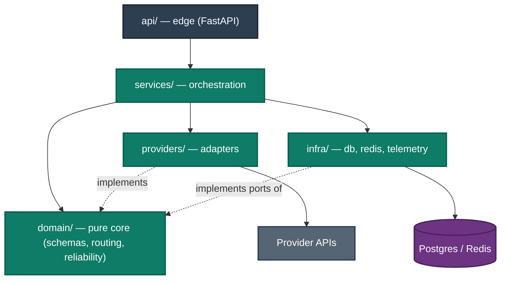
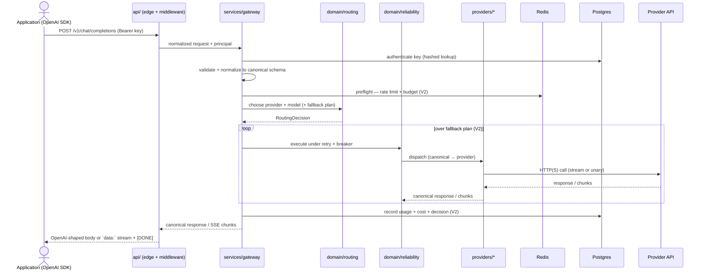
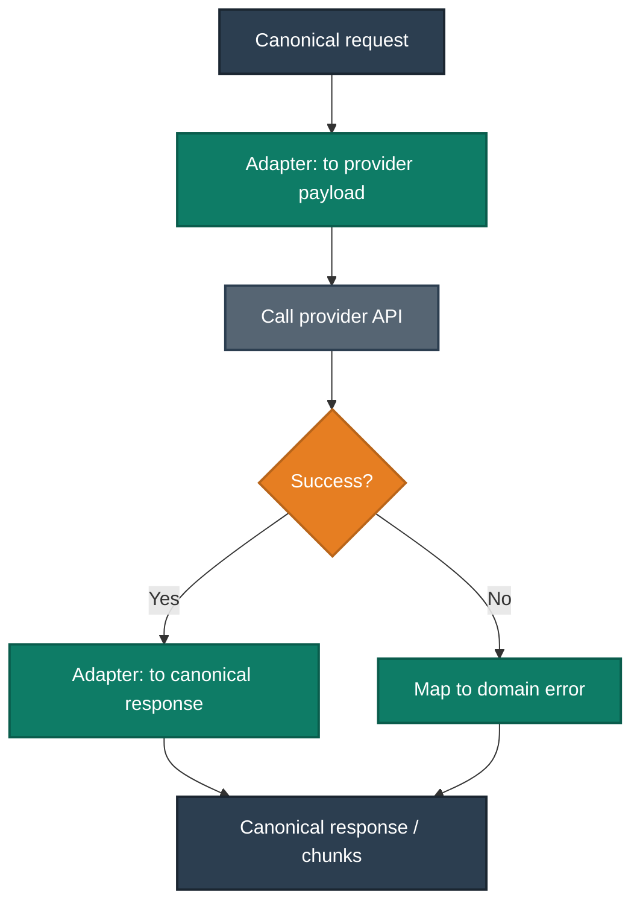
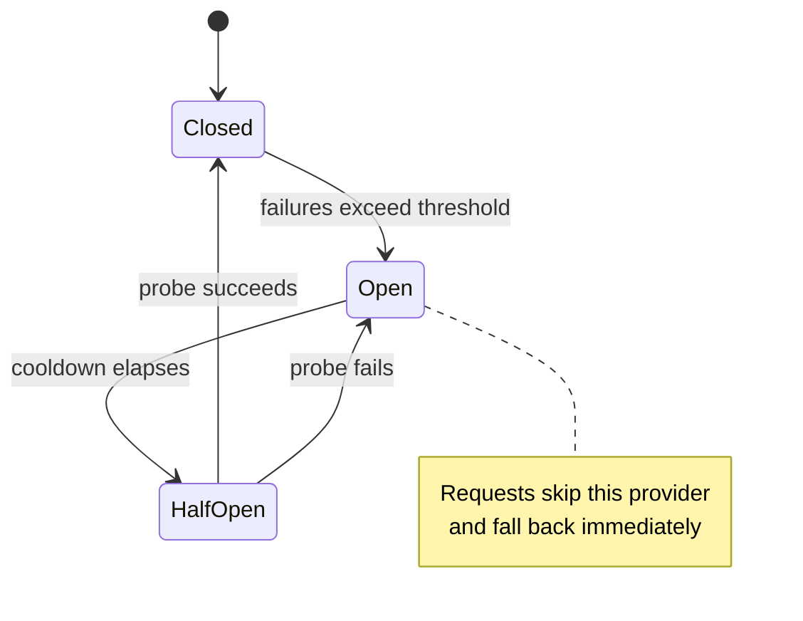
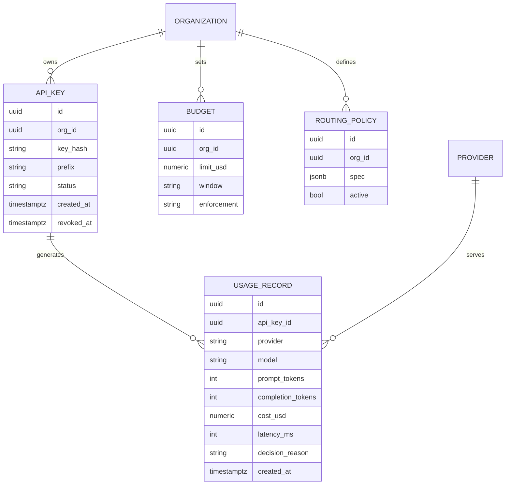

# Conduit — Architecture & System Design

**Owner:** Core maintainers · **Status legend:** ✅ built / committed · ⚠️ later-phase
**Purpose:** The canonical design of Conduit — components and responsibilities, the request lifecycle, the provider contract, the routing and reliability layers, the data model, and cross-cutting concerns. Keep this in sync with the code; it is the reference `CLAUDE.md` points to.

---

## 1. Context & goals

Conduit is the control plane between applications and LLM providers. Applications speak one stable, OpenAI-compatible API; Conduit decides, per request, which provider and model to use, whether to retry or fall back, whether the budget and rate limits allow it, and how the request is logged, traced, and (later) cached.

Design goals, in priority order:
1. **Correctness & compatibility** — behave exactly like the OpenAI API for supported endpoints, including streaming and error shapes.
2. **Reliability** — never turn a provider hiccup into an unhandled failure; degrade predictably.
3. **Extensibility** — adding a provider or a routing strategy is a local change behind an interface.
4. **Observability & cost control** — every request is measurable and attributable.
5. **Operability** — one command to run; clean config; sane defaults.

## 2. Constraints & assumptions

- **Async-first Python** on FastAPI; the request path does no blocking I/O (ADR-0002).
- **Postgres** is the system of record; **Redis** holds ephemeral fast-path state (ADR-0004). Losing Redis degrades limits/breakers to fail-safe defaults but must not lose durable data.
- Provider SDKs and vendor quirks are **quarantined in `providers/`**; the rest of the system sees only canonical schemas (ADR-0003).
- The domain core is pure: no framework, ORM, HTTP, or vendor imports.
- Secrets (gateway keys, provider credentials) never appear in logs, traces, metric labels, or URLs.

## 3. High-level architecture (C4)

Paste the workspace below into Structurizr Lite / structurizr.com and export each view. It models the whole system once and defines System Context, Container, and a focused Gateway-component view.

```structurizr
workspace "Conduit" "Open-source AI Gateway / control plane for LLM traffic" {
    !identifiers hierarchical

    model {
        dev    = person "Application / Developer" "Sends OpenAI-compatible requests instead of calling providers directly."
        admin  = person "Platform Operator" "Manages keys, budgets, routing policies; watches dashboards."

        conduit = softwareSystem "Conduit" "AI Gateway: routing, reliability, cost, governance, observability." {
            api = container "Gateway API" "Edge + orchestration: auth, validation, routing, execution, streaming." "Python / FastAPI" "Service" {
                edge     = component "Edge (api/)" "Routers, middleware, auth, OpenAI-shaped errors."
                pipeline = component "Gateway pipeline (services/)" "Authn → validate → preflight → route → execute → account." "" "Emphasis"
                routing  = component "Routing engine (domain/routing)" "RoutingStrategy: static now; cost/latency/capability later."
                resilience = component "Reliability (domain/reliability)" "Retry, circuit breaker, fallback policies."
                registry = component "Provider registry (providers/)" "name → provider adapter."
                openai   = component "OpenAI adapter" "Translates canonical ⇄ OpenAI."
                ollama   = component "Ollama adapter" "Translates canonical ⇄ Ollama."
            }
            worker = container "Background Workers" "Health probes, usage roll-ups, benchmarking." "Python / arq" "Service"
            db     = container "PostgreSQL" "System of record: keys, usage, budgets, policies, audit." "PostgreSQL 16" "Database"
            cache  = container "Redis" "Rate-limit buckets, breaker state, health, semantic cache." "Redis 7" "Database"
            otel   = container "Telemetry pipeline" "OTLP traces + Prometheus metrics + Grafana." "OTel / Prometheus / Grafana" "Service"
        }

        openaiApi = softwareSystem "OpenAI API" "Hosted models." "External"
        ollamaSrv = softwareSystem "Ollama" "Local model runtime." "External"
        futureLLM = softwareSystem "Other providers" "Anthropic, Gemini, Bedrock, vLLM (later)." "External"

        dev   -> conduit.api "Sends chat/completions" "OpenAI-compatible JSON/HTTPS + SSE"
        admin -> conduit.api "Manages keys, budgets, policies" "HTTPS"
        admin -> conduit.otel "Views dashboards" "HTTPS"

        conduit.api -> conduit.db "Reads/writes durable state" "SQL/async"
        conduit.api -> conduit.cache "Limits, breaker state, cache" "RESP"
        conduit.api -> conduit.otel "Emits traces + metrics" "OTLP / /metrics"
        conduit.api -> openaiApi "Dispatches" "HTTPS"
        conduit.api -> ollamaSrv "Dispatches" "HTTP"
        conduit.api -> futureLLM "Dispatches" "HTTPS"

        conduit.worker -> conduit.db "Writes roll-ups"
        conduit.worker -> conduit.cache "Updates health/breaker"
        conduit.worker -> openaiApi "Health probes / benchmarks" "HTTPS"

        conduit.api.edge -> conduit.api.pipeline "Delegates"
        conduit.api.pipeline -> conduit.api.routing "Asks for a decision"
        conduit.api.pipeline -> conduit.api.resilience "Wraps execution"
        conduit.api.pipeline -> conduit.api.registry "Resolves provider"
        conduit.api.registry -> conduit.api.openai "creates"
        conduit.api.registry -> conduit.api.ollama "creates"
    }

    views {
        systemContext conduit "SystemContext" { include * autolayout lr }
        container conduit "Containers" { include * autolayout lr }
        component conduit.api "Comp_Gateway" { include * autolayout lr }

        styles {
            element "Element"          { shape roundedbox color #FFFFFF }
            element "Person"           { shape person background #2C3E50 color #FFFFFF }
            element "Software System"  { background #1B4F72 color #FFFFFF }
            element "Container"        { background #2471A3 color #FFFFFF }
            element "WebTier"          { background #2E86C1 color #FFFFFF }
            element "Service"          { background #1A5276 color #FFFFFF }
            element "Component"        { background #5499C7 color #FFFFFF }
            element "Emphasis"         { background #0E7C66 color #FFFFFF }
            element "Database"         { shape cylinder background #6C3483 color #FFFFFF }
            element "External"         { background #566573 color #FFFFFF }
            element "Boundary"         { strokeWidth 5 }
            relationship "Relationship" { thickness 4 color #34495E }
        }
    }

    configuration { scope softwaresystem }
}
```

## 4. Layering & dependency rule

Hexagonal / ports-and-adapters. Dependencies point inward; the domain depends on nothing external.



`domain/` defines protocols (ports); `providers/` and `infra/` implement them (adapters); `services/` wires them together; `api/` is a thin edge. This is what makes each piece independently testable — the domain needs no I/O, and adapters are swapped for fakes/`respx` in tests.

## 5. Request lifecycle

The pipeline in `services/gateway.py`. Every stage is a defined seam; a stage may be a no-op until its phase lands.



Streaming and non-streaming share stages 1–4 and the normalization layer; only the execution/return differ (an async iterator of `chat.completion.chunk` vs a single body).

## 6. Repeating unit — the provider adapter

Providers are the system's main repeating unit. Every adapter follows one structure, so a new provider is a mechanical addition (ADR-0003).

**Contract → Capabilities → Translation → Errors → Streaming → Health → Registration**

- **Contract.** Implement `providers/base.Provider`, an async protocol:
  - `name: str` and a set of advertised `models` with metadata (context window, supports tools / JSON mode / vision, price per input/output token).
  - `async def chat_completion(req: ChatCompletionRequest) -> ChatCompletionResponse`
  - `async def stream_chat_completion(req) -> AsyncIterator[ChatCompletionChunk]`
  - `async def health() -> HealthStatus`
- **Capabilities.** `supports(capability) -> bool` (and structured capability metadata) so the routing engine can match requirements to providers.
- **Translation.** Convert canonical (OpenAI-shaped) ⇄ provider-native in the adapter only. No provider field names leak outward.
- **Errors.** Map provider errors onto `domain.errors` (e.g. `ProviderTimeout`, `ProviderRateLimited`, `UpstreamInvalidRequest`) so retry/breaker/fallback logic is provider-agnostic and the edge can render a consistent envelope.
- **Streaming.** Yield canonical chunks; own the provider's SSE/framing details internally.
- **Health.** Cheap probe used by the health worker and readiness.
- **Registration.** Register the factory in `providers/registry.py`. That is the *only* other file that changes.



## 7. Routing engine

`domain/routing` turns a request + context into a `RoutingDecision` (chosen provider/model + ordered fallback plan + the reason). All strategies implement one interface, so the MVP's static mapping and V3's intelligent strategies are interchangeable.

- **MVP:** `StaticStrategy` — explicit `model → provider` map. ✅
- **V3:** `CostAware`, `LatencyAware`, `CapabilityAware`, and a `PolicyStrategy` that composes constraints (required capabilities, allow/deny lists) with preferences (minimize cost / latency) and fallbacks. ⚠️
- Inputs available to a strategy: request features (size, requested capabilities, requested model), live signals (per-provider latency percentiles, health, breaker state from Redis), and durable policy (from Postgres). The chosen decision is recorded per request for later analysis.

## 8. Reliability layer (V2) ✅ built

Pure policies in `domain/reliability`; their runtime state lives in Redis via an infra adapter.
Implemented in Phase 2; the fail-safe posture (rate limits + breaker fail **open** on a Redis
outage; budgets are enforced from Postgres and stay strict) is fixed in **ADR-0005**. The
gateway wires them in pipeline order: preflight (rate limit → budget) → route → execute
(breaker → retry → fallback) → account (usage), with a per-provider health probe + usage
rollups run by the `arq` worker.

- **Retry** — bounded attempts, exponential backoff with jitter, only on errors classified retryable.
- **Fallback** — on exhaustion or an open breaker, advance to the next entry in the routing decision's plan.
- **Circuit breaker** — per provider (and optionally per model), state in Redis:



- **Health monitoring** — an arq worker probes providers on a schedule and updates health in Redis, which routing consults.

## 9. Data model

Postgres holds durable state; Redis holds ephemeral fast-path state. Simplified ER (durable side):



Redis keyspace (ephemeral): `ratelimit:{scope}:{id}` (token bucket), `breaker:{provider}` (state + counters), `health:{provider}`, `cache:{hash}` and embedding index refs (V5). Nothing in Redis is a source of truth; on loss, limits/breakers reset to fail-safe defaults.

## 10. Observability (V4)

- **Tracing:** OpenTelemetry spans across edge → routing decision → provider call, exported via OTLP. Span attributes carry provider, model, decision reason, token counts, latency — **never** prompts, completions, keys, or credentials.
- **Metrics:** Prometheus — RED metrics per route and per provider, token and cost counters, breaker/limit/health gauges — scraped from `/metrics`.
- **Dashboards:** Grafana provisioned as code (compose profile): cost, latency (p50/p95/p99), token throughput, error analytics, and provider comparison.
- **Logs:** structlog JSON in prod; correlated by request-id issued at the edge.

## 11. Cross-cutting concerns

- **Security & secrets.** Gateway-issued keys stored as hashes (lookup by prefix + verify hash). Upstream provider credentials are externalized/encrypted, never logged. Central redaction in logging/tracing. Errors never echo secrets or full request bodies.
- **Configuration.** All via `pydantic-settings` under the `CONDUIT_` prefix; a single `Settings` object injected through the app factory. No scattered `os.getenv`.
- **Concurrency & scale.** Stateless API replicas behind a load balancer; shared state in Redis/Postgres, so scaling out is horizontal. One pooled async `httpx` client; connection limits tuned via settings. Workers scale independently.
- **Failure posture.** Fail safe: if Redis is unavailable, limits/breakers adopt conservative defaults and the request path stays up. If a provider is down, fallback and breakers absorb it. Unhandled 500s are treated as defects.
- **Testing seams.** Domain is pure (fast unit tests). Integration tests use testcontainers for real Postgres + Redis and `respx` to simulate providers, including failures, timeouts, and malformed responses.

## 12. Key decisions & trade-offs

Recorded as ADRs in `docs/adr/`:
- **ADR-0001** — we record architecture decisions (process).
- **ADR-0002** — Python 3.12 + FastAPI (async-first) over Go, for ecosystem fit and delivery speed, with the hot path isolated so it could be re-implemented later.
- **ADR-0003** — a canonical OpenAI-compatible schema with provider adapters behind a protocol, rather than per-provider passthrough.
- **ADR-0004** — Postgres as system of record + Redis for fast-path state, rather than one store for both.
- **ADR-0005** — reliability layer (rate limit, budget, retry, breaker, fallback) + the Redis fail-safe posture: limits/breakers fail open, budgets stay strict on Postgres.

## 13. Risks & mitigations

- **Provider API drift** breaking adapters → contract tests per adapter against recorded fixtures; adapters are small and isolated.
- **OpenAI-compat gaps** (edge cases in streaming, tool calls, error shapes) → compatibility tests using the real OpenAI SDK against Conduit. ✅ (gate in Phase 1 DoD)
- **Semantic cache correctness** (serving a wrong "similar" answer) → conservative similarity threshold, opt-in per policy, invalidation tests. ⚠️ (V5)
- **Redis outage** degrading limits/breakers → explicit fail-safe defaults and tests for the degraded path.
- **Cost accounting inaccuracy** → reconcile computed cost against provider-reported usage within a documented tolerance. ✅ (Phase 2 DoD)
- **Scope creep toward "an AI app"** → the non-goals in `docs/ROADMAP.md` are binding; reject features that only make sense for a chatbot/RAG product.
