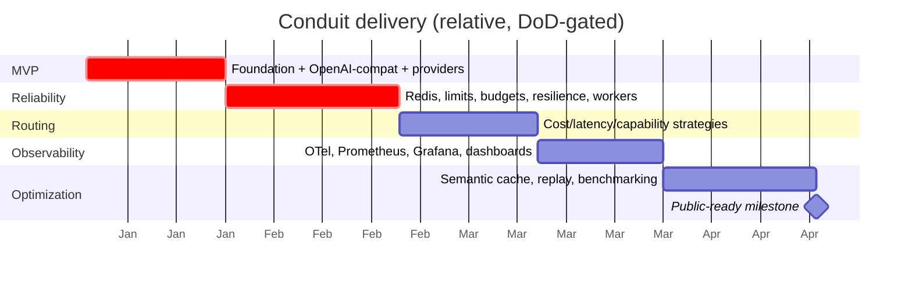

# Conduit — Roadmap & Delivery Plan

**Owner:** Core maintainers · **Status legend:** ✅ in scope / committed · ⚠️ deferred to a later phase
**Purpose:** Define what Conduit is, what it is deliberately not, and the exact order in which it gets built. Claude Code follows this document top-to-bottom. A phase does not start until the previous phase meets its **Definition of Done (DoD)**.

---

## Mission

Build the most production-ready open-source **AI Gateway** for modern LLM applications — the control plane between applications and every model provider. A developer should never call OpenAI, Anthropic, Gemini, or Ollama directly; every request goes through Conduit, which owns routing, reliability, cost, governance, and observability.

Think **Cloudflare + Kong + Envoy + OpenRouter + Stripe + LangSmith**, for AI traffic.

A Staff Engineer skimming the repo should immediately read *production thinking, architectural maturity, scalability, maintainability, extensibility* — not "another AI project."

## Non-goals

Conduit is **not**, and will not drift into being: a chatbot ⚠️ · an AI assistant ⚠️ · a prompt playground ⚠️ · a LangChain-style orchestration demo ⚠️ · a RAG application ⚠️. It is infrastructure. Features that only make sense for those products are out of scope by definition.

## Guiding constraints (apply to every phase)

- Build incrementally; every merged feature is production-worthy. ✅
- Prefer architecture over shortcuts; every abstraction has a recorded reason. ✅
- Avoid unnecessary frameworks; keep the dependency set small and deliberate. ✅
- Every component is independently testable. ✅
- Never break the OpenAI-compatible API contract without an ADR. ✅

---

## Phase overview

| Phase | Theme | Outcome | Status |
|---|---|---|---|
| **1 — MVP** | A real product on day one | OpenAI-compatible gateway, OpenAI + Ollama providers, auth, streaming, Docker | ✅ |
| **2 — Reliability** | Production infrastructure | Redis, rate limits, budgets, usage, retry, circuit breakers, health, fallback, workers | ✅ |
| **3 — Intelligent routing** | Smart model selection | Cost / latency / capability-aware routing, policies, classification, orchestration | ✅ |
| **4 — Observability** | See everything | OpenTelemetry, Prometheus, Grafana, traces, cost & latency dashboards, error analytics | ✅ |
| **5 — Optimization** | Do more with less | Semantic caching, dedup, replay, cost prediction, token estimation, adaptive routing, benchmarking | ✅ |
| **Long-term** | The default AI substrate | Multi-tenant governance, plugin ecosystem, K8s/Helm, high-availability control plane | ⚠️ |

Indicative sequencing (not calendar-bound; gate on DoD, not dates):

---

## Phase 1 — MVP

**Goal:** From the first release, Conduit feels like a real product: point an OpenAI SDK at it and it works, with auth, streaming, and one command to run.

In scope:
- OpenAI-compatible API surface — `POST /v1/chat/completions` (streaming + non-streaming), `GET /v1/models`. ✅
- Provider abstraction layer — the `Provider` protocol + registry (ADR-0003). ✅
- **OpenAI** provider adapter. ✅
- **Ollama** provider adapter (local models; validates the abstraction against a very different backend). ✅
- API key management — issue, list, revoke gateway keys; keys stored hashed. ✅
- Authentication — bearer key on every request; principal resolution. ✅
- Request validation — strict Pydantic v2 models; OpenAI-shaped error envelope. ✅
- Streaming — SSE `chat.completion.chunk` events, correct `[DONE]` termination. ✅
- Fully async request path. ✅
- Docker deployment — multi-stage image + `docker compose up` (api + postgres + redis). ✅
- Static `model → provider` routing (the seam the V3 engine will later fill). ✅

Deferred: intelligent routing ⚠️ (V3), rate limits/budgets ⚠️ (V2), retries/breakers ⚠️ (V2), tracing/metrics beyond basic structured logs ⚠️ (V4), caching ⚠️ (V5).

**Definition of Done**
- A stock OpenAI SDK with `base_url` set to Conduit completes a chat request and a streamed chat request against **both** OpenAI and Ollama, changing only the `model`.
- Requests without a valid key are rejected with an OpenAI-shaped `401`; malformed requests return an OpenAI-shaped `400`.
- `docker compose up` yields a healthy stack; `GET /healthz` and `GET /readyz` reflect real dependency health.
- `make check` is green: `ruff` clean, `mypy --strict` clean, unit + integration tests pass. Integration tests run against real Postgres + Redis (testcontainers) with providers mocked via `respx`.
- Detailed task list: `docs/phases/PHASE-01-MVP.md`.

## Phase 2 — Reliability (production infrastructure)

**Goal:** Conduit survives provider failures, enforces limits and budgets, and tracks usage — the difference between a demo and infrastructure.

In scope:
- Redis integration as the fast-path state store. ✅
- Rate limiting with **token-bucket** semantics, per key and per org, enforced in Redis (atomic via Lua). ✅
- Budget management — per-key/org spend caps with hard/soft limits; requests rejected when the budget is exhausted. ✅
- Usage tracking — per-request token counts and computed cost persisted to Postgres. ✅
- Retry logic — bounded retries with exponential backoff + jitter on transient provider errors. ✅
- Circuit breakers — per-provider breaker (closed/open/half-open) with state in Redis. ✅
- Provider health monitoring — periodic probes; unhealthy providers are skipped. ✅
- Automatic fallback — on failure/open-breaker, walk the fallback plan to the next viable provider/model. ✅
- Background workers — **arq** for health probes and usage roll-ups. ✅

**Definition of Done**
- A provider forced to fail (via `respx`) causes retries, then fallback, then a clean OpenAI-shaped error only if all options are exhausted — never an unhandled 500.
- Exceeding a key's rate limit returns `429` with correct rate-limit headers; exceeding a budget returns a `402`-style error.
- Repeated failures trip the breaker; it half-opens and recovers on probe success — covered by tests.
- Usage rows are written for every request and reconcile with provider-reported token counts within tolerance.
- Workers run under compose and are covered by integration tests. `make check` green.

## Phase 3 — Intelligent routing

**Goal:** Conduit chooses the *right* provider/model per request, not a hardcoded one.

In scope, all behind the `RoutingStrategy` interface established in the MVP:
- Cost-aware routing (cheapest capable option within policy). ✅
- Latency-aware routing (use observed p50/p95 latency per provider). ✅
- Capability-aware routing (match required capabilities: context length, tools, JSON mode, vision). ✅
- User-defined routing policies (declarative: constraints + preferences + fallbacks). ✅
- Request classification (size/complexity signals feeding model selection). ✅
- Smart model selection and multi-provider orchestration. ✅

**Definition of Done**
- Given a policy, identical requests route to different providers/models as cost/latency/capability inputs change — proven by tests with synthetic signals.
- Policies are declarative, validated, and hot-reloadable without redeploy.
- The routing decision (chosen provider/model + reason) is recorded on every request for later analysis. `make check` green.

## Phase 4 — Observability

**Goal:** Every request is measurable, traceable, and explainable.

In scope:
- OpenTelemetry tracing end-to-end (edge → routing → provider call), OTLP export. ✅
- Prometheus metrics (RED metrics per route/provider, token counters, cost counters, breaker/limit gauges). ✅
- Grafana dashboards shipped as code (provisioned in compose): cost, latency, tokens, errors, provider comparison. ✅
- Request traces with useful spans and attributes (no secrets/prompt bodies). ✅
- Token analytics, cost dashboards, provider comparison, latency dashboards, error analytics. ✅

**Definition of Done**
- A single request produces a coherent trace spanning edge → decision → provider, viewable via the OTLP pipeline in compose.
- Prometheus scrapes `/metrics`; the Grafana stack boots via a compose profile with dashboards pre-provisioned and populated by traffic.
- No secret, credential, or full prompt/response body appears in any span, metric label, or log — enforced by test. `make check` green.

## Phase 5 — Optimization

**Goal:** Cut cost and latency without changing client code.

In scope:
- Semantic caching (embedding-based similarity; configurable threshold; safe invalidation). ✅
- Prompt deduplication (collapse in-flight identical requests). ✅
- Request replay (deterministic re-execution of a recorded request for debugging). ✅
- Cost prediction and token estimation (pre-flight estimate before dispatch). ✅
- Adaptive routing (feed live cost/latency/quality back into routing weights). ✅
- Automatic model benchmarking (scheduled quality/latency/cost probes across providers). ✅

**Definition of Done**
- A semantically equivalent repeat request is served from cache (measurably cheaper/faster), with correctness and invalidation covered by tests.
- A recorded request replays deterministically.
- Pre-flight token/cost estimates land within a documented tolerance of actuals on a benchmark set. `make check` green.

## Long-term vision ⚠️

Become the open-source layer teams place in front of **every** LLM application — the NGINX/Kong/Cloudflare of AI. Later, non-committed directions: full multi-tenant governance and audit ⚠️, a plugin ecosystem for providers and policies ⚠️, first-class Kubernetes/Helm deployment and HA control plane ⚠️, additional first-party provider adapters (Anthropic, Gemini, Bedrock, vLLM, …) ⚠️. These are deferred until the five core phases are solid — an infrastructure product earns adoption by being reliable before it is broad.

---

## What "done well" looks like

The finished repository reads like production infrastructure: a small, deliberate dependency set; clean layering with vendor code quarantined behind adapters; tests that run the real datastores and mock only the network edge; observability and cost controls that are first-class rather than bolted on; and documentation (this file, `ARCHITECTURE.md`, the ADRs) that a new engineer can read in an afternoon and then contribute a provider adapter by the next morning.
